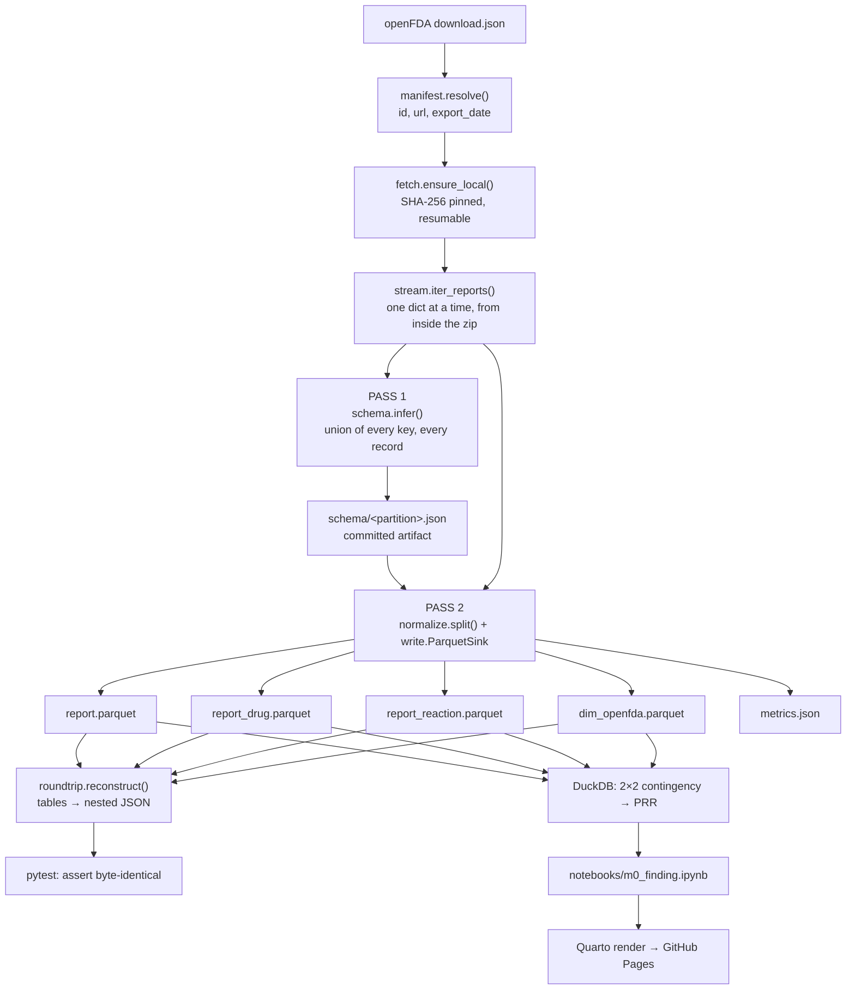

# M0 — Walking Skeleton Design

**Spec:** [`spec.md`](spec.md)
**Status:** Approved

---

## The one decision that shapes everything

The spike loaded 1.2 GB with `json.load` and inferred its schema by inspecting `results[0]`. Both have to go, and they fail for the same underlying reason: **the schema was discovered from a sample.** That single habit produced every bug L-005 caught — `companynumb` missing from 89.6% of reports, `patient.summary` from 49.1%, `reportduplicate` dropped entirely.

So M0 is built on the opposite rule:

> **The schema is computed from every record, written to a file, and reviewed before any data is written against it.**

This rules out the convenient path — streaming to NDJSON and letting DuckDB infer types on the way to Parquet. DuckDB infers from a row sample by default, and while a flag can force a full scan, a design where losing a field means forgetting a keyword argument is a design that invites L-005 back. Two passes with an explicit `pyarrow.Schema` costs ~40 extra lines and makes the failure mode structural instead of optional.

The schema file is not a chore either. **It is exactly the artifact M1's schema-drift detection needs** — drift becomes a diff between two committed schema files, not a bespoke mechanism invented later.

---

## Flow



---

## Module boundaries

Narrow interfaces, deep implementations. Each module hides one hard thing and exposes one obvious function.

| Module | Public interface | Hides |
|---|---|---|
| `hindsight/manifest.py` | `resolve(partition_id) -> Partition` | openFDA's `download.json` shape, URL construction, export-date extraction |
| `hindsight/fetch.py` | `ensure_local(partition) -> Path` | Resume, atomic rename, SHA-256 verification, cache hit/miss |
| `hindsight/stream.py` | `iter_reports(zip_path) -> Iterator[dict]` | Zip member selection, incremental JSON parsing, never materializing `results` |
| `hindsight/schema.py` | `infer(reports) -> Schemas` · `save/load(path)` | Type unification across 12,000 heterogeneous records |
| `hindsight/normalize.py` | `split(report) -> RowSet` | The `openfda` hashing rule and the empty-dict trap |
| `hindsight/write.py` | `ParquetSink(schema, path)` (context manager) | Batching, row groups, ZSTD-9, bounded memory |
| `hindsight/roundtrip.py` | `reconstruct(tables, report_id) -> dict` | Reassembling nested JSON from four flat tables |
| `hindsight/cli.py` | `hindsight ingest <partition-id>` | Wiring the above into one command |

**Why `stream` and `schema` are separate modules:** pass 1 and pass 2 both consume `iter_reports`. If schema inference lived inside the streamer, you couldn't run it twice, and the two-pass design would collapse back into sampling.

---

## Data contracts

Four tables. `safetyreportid` is the join key throughout.

**`report`** — one row per report
- `safetyreportid` (string, PK)
- every top-level field except `patient`
- every `patient` scalar/struct field except `drug` and `reaction`, prefixed `pt_`

The prefix is what makes the round trip unambiguous: at reconstruction time, `pt_*` keys go back inside `patient` and everything else stays at top level. No lookup table needed, no guessing.

**`report_drug`** — one row per drug per report
- `safetyreportid`, `seq` (int, position in the original array — **this is what makes the round trip order-preserving**)
- `openfda_key` (string, nullable)
- every other drug field

**`report_reaction`** — one row per reaction per report
- `safetyreportid`, `seq`, every reaction field

**`dim_openfda`** — one row per distinct enrichment block
- `openfda_key` (string, PK) = `sha1(json.dumps(block, sort_keys=True))[:16]`
- every openfda field (mostly `list<string>`)

### The two rules that are non-negotiable

1. **`openfda_key` is `None` only when the `openfda` field is absent.** An `openfda: {}` present in the source hashes to the key of the empty dict and gets a dimension row. This is the exact bug that produced 492 mismatches in the spike — the difference between *"we checked and found nothing"* and *"we never looked."*

2. **Nested single objects stay as Arrow structs**, not flattened, not JSON-stringified. `pt_summary`, `primarysource`, `sender`, `receiver`, `reportduplicate` are all structs. Parquet stores them natively and reconstruction is a straight assignment. Flattening would need an escape convention for the separator, and every escape convention eventually meets a field name that contains the separator.

---

## Memory strategy

Three things could blow up memory. All three are bounded by design:

| Risk | Bound |
|---|---|
| The 1.2 GB JSON | Never materialized — `ijson.items(f, 'results.item')` yields one ~100 KB dict at a time, read straight from the zip member via `ZipFile.open()`. No disk extraction either |
| Accumulating rows before write | `ParquetSink` flushes a row group every N reports (start N=2000) and drops the buffer |
| The `openfda` dimension | A `set` of 16-char hash strings, and each block written **on first sight**. The spike held every distinct block in a dict; holding only the hashes is ~150 KB instead of ~16 MB, and it's the version that still works at 1,767 partitions |

Expected peak RSS: well under 200 MB. The spec's 500 MB ceiling is deliberately loose — it's there to catch a design regression, not to be tuned against.

---

## Two-pass cost

Pass 1 re-reads the zip. Decompression of 246 MB is a few seconds locally, and it happens once per partition ever — the inferred schema is cached to `schema/<partition>.json`, so re-runs skip pass 1 entirely.

At M1 scale the schema is inferred per *era*, not per partition, and partitions validate against it. That's the drift check, and it falls out of this design for free.

---

## Analysis layer

DuckDB reads the Parquet directly — no load step, no database file.

```sql
-- shape only; you write the real one in T13
WITH pairs AS (
  SELECT d.medicinalproduct AS drug, r.reactionmeddrapt AS event
  FROM report_drug d
  JOIN report_reaction r USING (safetyreportid)
  WHERE r.reactionmeddrapt NOT IN (SELECT term FROM excluded_terms)
)
-- 2×2: a = drug&event, b = drug&¬event, c = ¬drug&event, d = neither
-- PRR = (a/(a+b)) / (c/(c+d))
```

The exclusion list is a committed CSV with a `reason` column per term, not an inline `NOT IN (...)`. It will be argued about later, so it needs to be reviewable and diffable.

**Stated on the page, not buried:** one partition, no entity resolution, so `TYLENOL` and `paracetamol` are still separate drugs and every number is provisional.

---

## Repo layout

```
hindsight/
├── pyproject.toml            # uv, Python 3.12
├── Makefile                  # make all
├── src/hindsight/
│   ├── manifest.py  fetch.py  stream.py
│   ├── schema.py    normalize.py  write.py
│   ├── roundtrip.py  cli.py
│   └── analysis/prr.py
├── data/                     # gitignored
│   ├── raw/  parquet/  manifest/
├── schema/                   # committed
├── reference/excluded_terms.csv
├── notebooks/m0_finding.ipynb
├── tests/
│   ├── fixtures/sample_100.json   # committed, ~100 reports
│   └── test_roundtrip.py
├── _quarto.yml
└── .github/workflows/{ci,publish}.yml
```

`data/` is a cache and is gitignored. The reproducibility claim rests on `manifest/` + `schema/`, both committed — pin, don't hoard (AD-008).

---

## Dependencies beyond PROJECT.md

- **`ijson`** — incremental JSON parsing. Not in the PROJECT.md list; add it. Without it there is no streaming pass and M0-05 is unmeetable.
- **`pytest`** — the round-trip test is a test, not a script.
- **`typer`** *(optional)* — CLI. `argparse` is fine and is one less dependency.

`polars` is listed in PROJECT.md but M0 doesn't need it — pyarrow writes the Parquet and DuckDB queries it. Pull it in when a transform actually wants a dataframe.

---

## Open questions, deliberately unresolved

| Question | Resolve at |
|---|---|
| Is `sha1[:16]` enough for the dimension key? | T7 asserts no collision on the partition. If it ever fires, widen to 32 |
| Row-group size of 2000 — right? | T18 measures. Only tune if peak RSS is near the ceiling |
| Which 2005-era partition id? | T19, from the manifest. openFDA starts 2004q3 |
| Does openFDA carry every FAERS ASCII field? | Deferred to M1 (AD-002 todo). M0 doesn't need it |
