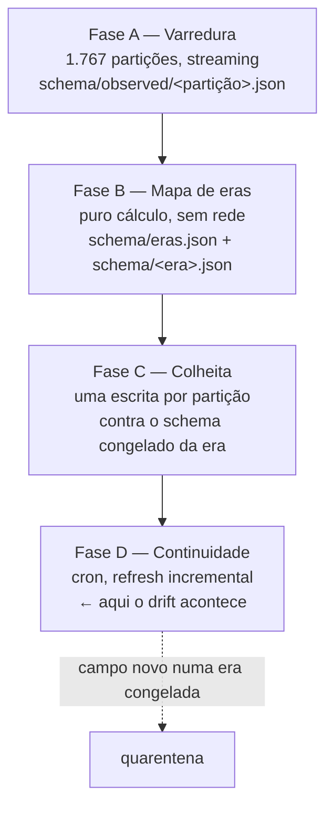

# M1 — Corpus completo: design

**Spec:** [`spec.md`](spec.md) · **Arquitetura atual:** [`../../../ARCHITECTURE.md`](../../../ARCHITECTURE.md)
**Status:** Rascunho — revisado em 18/08/2026, **9 bloqueantes abertos**. Não implementar como está; ver o cabeçalho de `.specs/project/STATE.md`

---

## As três circularidades que o ROADMAP não resolve

O ROADMAP da M1 foi escrito na revisão de 14/08 e está certo no nível de intenção. No nível de
mecanismo, três das features se referenciam em círculo, e o design da M1 é sobretudo a resolução
delas.

**1. Era é descoberta pela passagem 1, mas a passagem 1 é escopada por era.** AD-017 define era como
"um intervalo contíguo de buckets com o mesmo conjunto de caminhos de campo, descoberto pela
passagem 1". AD-018 diz que o M1 "processa uma era por vez, retendo os zips daquela era entre a
passagem 1 e a passagem 2". Não dá para escopar por era antes de conhecer as fronteiras, e as
fronteiras vêm da varredura.

**2. O pico de disco é o tamanho da maior era, e não se sabe quais são as eras.** O ROADMAP manda
"medir o tamanho da maior era pelo manifesto antes de rodar". O manifesto traz tamanho por
*partição* e pertencimento a *bucket*; uma era abrange vários buckets. Antes da varredura, o
manifesto não sabe dizer onde uma era termina.

**3. A quarentena de drift não tem quando acontecer na primeira colheita.** Se a varredura já leu
*todas* as partições da era antes de qualquer escrita, então o schema congelado da era contém, por
construção, todo campo que aquela era tem. `enforce` nunca levanta `UnknownField` durante a
colheita inicial. O drift é um fenômeno **do refresh**, não da colheita — e AD-017 não diz isso.

### A resolução: três fases sobre o corpus, não duas passagens sobre uma era



A passagem 1 e a passagem 2 da M0 continuam existindo — só deixam de ser duas leituras adjacentes
do mesmo zip e viram **duas fases separadas sobre o corpus**. A passagem 1 de uma partição é a Fase
A; a passagem 2 é a Fase C. `schema.infer` e `write.write_partition` não mudam de contrato.

**O que isso custa, dito sem maquiagem:** o corpus é transferido **duas vezes**. ~2,7 h medidas por
passada, ~5,4 h no total. É exatamente o custo que AD-018 rejeitou. A retenção de AD-018 evitaria a
segunda transferência **se a era coubesse em disco**, e ninguém sabe se cabe: o manifesto diz que
2015+ soma 90,7 GB, e se a varredura encontrar poucas eras grandes, "reter a era" é reter dezenas
de GB numa máquina com ~50 GB livres.

**A emenda proposta (AD-023):** a retenção vira **condicional a um orçamento de disco declarado**.
A Fase A retém os zips que baixa enquanto couberem no orçamento; ao fechar uma era, se o cache
daquela era está completo, a Fase C lê do cache e não baixa nada. Se estourou, o cache da era é
descartado e a Fase C rebaixa. O orçamento é uma propriedade da máquina — não é uma constante medida
num dado e aplicada a todos, que é o erro de L-006. Custo: ~2,7 h nas eras que couberem, ~5,4 h nas
que não. Ganho: o pico de disco deixa de ser desconhecido e vira um argumento de linha de comando.

---

## Decisões propostas

Quatro decisões que a M1 precisa tomar antes da colheita. Cada uma tem uma task própria que a
escreve como AD no STATE — nenhuma é tomada dentro de uma task de implementação.

### AD-023 (proposta): retenção condicional a um orçamento de disco, emendando AD-018

Acima. Emenda AD-018 sem contradizê-la: a retenção continua sendo o caminho preferido, deixa de ser
o único.

**Alternativa rejeitada:** *reter sempre*. É AD-018 como está, e ela é indefensável contra uma era
de 90 GB numa máquina de 50 GB livres — o modo de falha é o crawl morrer no meio com o disco cheio,
que é pior do que a segunda transferência.

### AD-024 (proposta): a `dim_openfda` é global, não por partição — B-006

**O fato medido, hoje, nas duas partições ingeridas:** 866 dos 1.128 blocos de 2004 reaparecem na
partição de 2025. **76,8% da dimensão de 2004 é redundante contra uma partição 21 anos depois**, e
essas são as duas partições mais distantes que o corpus tem. Entre partições adjacentes a
sobreposição só pode ser maior.

A chave já é global por construção — 16 dígitos do SHA-1 do bloco em JSON canônico, então dois
blocos idênticos em partições diferentes geram a mesma chave. **Só a escrita é por partição**
(`write_partition` cria uma `OpenfdaDimension` nova a cada vez). Sobre 1.767 partições isso custa
~2,1 MB × 1.767 ≈ **3,7 GB de dimensão** contra 1,7–3,6 GB de fatos, e a G1 promete `< 5 GB`.

Isso é um bloqueador que ninguém tinha aberto. Vai para o STATE como **B-006**.

Ajuda: `dim_openfda` tem **as mesmas 19 colunas em 2004 e em 2025** — conferido nos dois schemas
versionados. É a única das cinco tabelas cuja forma não depende da era, o que torna uma dimensão
única sobre o corpus segura por schema.

**Forma proposta:** um diretório `data/parquet/dim_openfda/` fora da hierarquia `year=/quarter=/`,
escrito em pedaços por era, com a colheita mantendo em memória apenas o *conjunto de chaves já
vistas*. Sobre uma convergência plausível de algumas centenas de milhares de blocos, isso é dezenas
de MB de `set` — mensurável na Fase A, antes de a colheita começar.

**Alternativas rejeitadas:**
- *Dimensão por era.* Mais barata em memória e mantém a era como unidade. Mas 866 blocos atravessam
  2004→2025, então a redundância entre eras é justamente o que essa opção paga.
- *Deixar por partição e comprar mais espaço.* Não existe "comprar" com a restrição R$ 0, e o número
  fura a G1.
- *Deduplicar depois, num passo de compactação.* Adia o problema e obriga a reescrever as 1.767
  partições que já referenciam as chaves locais.

### AD-025 (proposta): `report` ganha um `ordinal`, e ele é a chave de junção — fecha B-004

`safetyreportid` não identifica um relato na era antiga: 6 ids repetidos em 12.000 em
`2004q1/0001-of-0005`, e os pares **não são o mesmo relato duas vezes** (diferem em
`transmissiondate` e em `companynumb` ou `primarysource`).

**Proposta:** `report` ganha `ordinal` — a posição do relato dentro da partição, `0..n-1` — e as
quatro tabelas filhas passam a carregar `ordinal` além de `safetyreportid`. A chave de junção dentro
de um diretório de partição é `ordinal`; a chave completa no corpus é `(diretório da partição,
ordinal)`.

**O que isso custa:** `ordinal` é um inteiro de 0 a 11.999, que dicionariza para quase nada em
Parquet. `safetyreportid` **permanece** em todas as tabelas — vira atributo em vez de chave, e é o
que M2 usa para falar de duplicata.

**O que isso não resolve, e precisa estar escrito:** `ordinal` **não é estável entre exports**. O
openFDA reparticiona trimestres (L-006), então a mesma submissão pode ter outro ordinal no export
seguinte. Ele é uma chave de *reconstrução dentro de um export*, não uma identidade durável. M4, que
precisa de identidade ao longo do tempo, não pode usá-la — e é melhor descobrir isso aqui do que lá.

**Alternativa rejeitada:** *round trip só nas eras onde os ids são únicos, com a cobertura
publicada.* Zero código, e publica um buraco exatamente onde a fonte é mais suja, que é onde a prova
mais vale.

### AD-026 (proposta): marcadores de forma, e a remoção de nulls deixa de existir — fecha B-005 e o todo de L-007

Hoje o round trip remove nulls dos dois lados antes de comparar. L-008 mediu que isso é um inverso
legítimo **na partição de 2025**, e disse em letras que a medição não transfere. Ela não transferiu:
`2004q1/0001-of-0005` carrega null explícito em **12.000 de 12.000** relatos.

**Proposta:** cada uma das cinco tabelas ganha uma coluna `source_shape` — uma lista de strings
nomeando os campos daquela linha que chegaram **explicitamente nulos** ou como **array vazio**. A
reconstrução lê essa coluna e reemite `null` ou `[]` onde estava, e omite a chave onde não estava.
Com isso `_without_nulls` **deixa de existir** dos dois lados da comparação, e o teste
`test_the_source_carries_no_explicit_nulls` deixa de ser necessário.

Uma coluna por tabela, cinco no total. Em 2004 o valor típico é `["receiver"]`, que dicionariza para
quase nada. `patient.drug: null` (1.375 relatos) vira `source_shape = ["patient.drug"]` na linha de
`report`, e a reconstrução emite `"drug": null` em vez de omitir a chave.

O mesmo mecanismo fecha o todo de L-007 — array vazio indistinguível de campo ausente, hoje sem
instância conhecida e com 1.767 partições pela frente para produzir uma.

**Alternativas rejeitadas:**
- *Uma máscara por campo anulável, nas cinco tabelas.* Exato e caro: dezenas de colunas booleanas
  quase todas falsas.
- *Declarar o null explícito como normalização anunciada.* É a "identidade após uma normalização não
  declarada" que AD-013 recusou em outro contexto, e o projeto não pode recusá-la ali e aceitá-la
  aqui.
- *Escopo declarado: o round trip prova as eras sem null explícito.* Zero código. Publica o buraco
  onde a fonte é mais suja e deixa a afirmação central do projeto com alcance de uma era.

---

## Fronteira de era: a regra

Buckets em ordem cronológica. Mantém-se `E`, o mapa acumulado caminho → tipo JSON da era aberta. O
bucket `B` **entra** na era aberta se, e só se:

1. nenhum caminho de `B` aparece com um tipo JSON diferente do que `E` já tem para aquele caminho, **e**
2. nenhum caminho de `E` está ausente de **todas** as partições de `B`.

Campo novo **alarga** `E` — a era continua. Conflito de tipo ou campo que sumiu **fecha** a era antes
de `B`, e `B` abre a próxima.

Nenhuma constante numérica. As duas condições são exatamente o que `schema._observe` e
`schema.enforce` já sabem detectar, então a fronteira é verificável pelo mesmo mecanismo que a usa —
que é o critério que AD-017 pediu.

**O falso positivo conhecido:** um campo esparso pode sumir de um bucket pequeno por acaso e fechar
uma era que não devia fechar. A mitigação **não** é um limiar de cobertura ("ausente em mais de 99%
dos relatos"), porque seria uma constante medida num export e aplicada a 2004–2025 — L-006 outra vez.
A mitigação é de processo: **a regra propõe a fronteira, o commit de `schema/eras.json` a aceita.**
Uma vez, à mão, como T19 foi o protótipo manual da medição de era. Depois disso é mecanismo.

**`all_other` é sua própria era, por construção.** O export tem um bucket `all_other/` de 4 partições
para relatos que não puderam ser datados. Ele não tem posição na linha do tempo, então não pode
entrar numa corrida cronológica sem que alguém escolha arbitrariamente onde encaixá-lo. Ser sua
própria era é a única opção que não inventa uma ordem.

**Uma previsão que a varredura vai confirmar ou derrubar.** Nos dois schemas já congelados,
`report_drug`, `report_reaction` e `report_duplicate` de 2004 são **subconjuntos estritos** de 2025;
só `report` tem um campo que existe em 2004 e não em 2025 (`pt_patientdeath`). Se a forma do dado for
majoritariamente aditiva, a regra pode encontrar **muito poucas eras** — talvez duas. Isso é um
resultado legítimo e não um defeito da regra. Mas tem uma consequência que precisa estar escrita: se
houver uma ou duas eras, **"uma era por vez" deixa de ser um mecanismo de escopo**, e o pico de
disco passa a ser governado inteiramente pelo orçamento de AD-023, em segmentos de buckets. O design
não depende da contagem de eras dar um número conveniente.

---

## Contratos de dados: o que muda nas cinco tabelas

| Tabela | Ganha | Motivo |
|---|---|---|
| `report` | `ordinal` (int), `source_shape` (list\<str\>) | AD-025, AD-026 |
| `report_drug` | `ordinal`, `source_shape` | idem |
| `report_reaction` | `ordinal`, `source_shape` | idem |
| `report_duplicate` | `ordinal`, `source_shape` | idem |
| `dim_openfda` | nada — sai da hierarquia de partição | AD-024 |

Regras que **não** mudam, e que a M1 herda sem relitigar:

- Nenhuma lista de campos a manter. `split` itera o registro.
- Colisão de nome é erro. `normalize._row` levanta `UnexpectedReportShape` — e agora `ordinal` e
  `source_shape` entram na lista de nomes reservados que `schema._pin_pipeline_columns` protege.
- `openfda` ausente e `openfda: {}` são coisas diferentes.
- `seq` nulo em `report_duplicate` marca objeto e não array.
- `roundtrip` importa **apenas** `normalize`. A prova não pode virar espelho do escritor.

---

## Memória: o job mais caro do projeto

`Tables.load` segura uma partição inteira em dicionários Python — 266 MB para 4,62 MB de Parquet. Com
o round trip dentro do `make all`, o pico é **486,8 MB contra o teto de 500 MB**. Treze MB de folga,
e o job por era de AD-019 roda uma partição por era no mesmo processo.

**Proposta:** a reconstrução vira um *merge* em streaming. Os cinco Parquet são lidos ordenados por
`ordinal` e avançados em paralelo, montando um relato por vez. `Tables.load` deixa de existir como
"carrega tudo e indexa"; vira um iterador de `(ordinal, documento)`.

Isso é possível **porque** AD-025 dá uma chave ordenável e densa. Com `safetyreportid` como chave, o
merge exigiria ordenação lexicográfica das cinco tabelas; com `ordinal`, as linhas já saem na ordem
de escrita e o merge é uma passada. As duas propostas se pagam mutuamente, e essa é a razão de
estarem na mesma fase.

Alvo: **< 250 MB** de pico no round trip da partição inteira. Metade do teto, para que a folga volte
a existir antes de o corpus crescer 883×.

---

## Falha, retomada e quarentena

O que a ARCHITECTURE hoje registra como lacuna, e o que a M1 precisa pôr no lugar:

| Hoje | Na M1 |
|---|---|
| "Não existe registro de progresso" — inferido por `glob` atrás de `report.parquet` | `data/progress.json`: por partição, um estado em `{pendente, varrida, escrita, quarentena, falha}` com timestamp e a razão |
| "Erro de rede não é embrulhado" — timeout ou `503` sobe como traceback | retry com backoff exponencial; esgotado, a partição vira `falha` e o crawl segue |
| "Não existe quarentena" — campo desconhecido interrompe com exceção | `UnknownField` é capturado pelo crawler, vira evento em `data/quarantine/<partição>.json` e a partição não é escrita |
| Atomicidade por arquivo, não por partição | a partição só é marcada `escrita` no progresso **depois** dos cinco `replace`; um estado intermediário é retomado do zero |

**O que a quarentena não faz:** não alarga o schema da era, não escolhe um valor padrão, não escreve
uma partição parcial. Ela registra e sai do caminho. AD-017 rejeitou o alargamento automático e essa
recusa é o conteúdo inteiro do mecanismo.

**Um crawl que morre é normal, não excepcional.** 1.767 partições a ~11,6 MB/s é uma janela de horas
numa rede doméstica. O desenho supõe que ele vai ser interrompido várias vezes e que isso não é um
incidente.

---

## Módulos novos e fronteiras

Seguindo a hierarquia da ARCHITECTURE — as setas apontam para baixo e `normalize` é o fundo.

| Módulo | Possui | Não conhece |
|---|---|---|
| `sweep` | a Fase A: varrer uma partição e gravar os caminhos observados | Parquet, eras |
| `era` | a regra de fronteira, `schema/eras.json`, o schema congelado por era | rede, Parquet |
| `progress` | o registro durável de progresso e a máquina de estados | o que uma partição contém |
| `crawl` | a ordem da colheita, retry/backoff, quarentena | como se escreve um Parquet — chama `write` |
| `quality` | a série temporal a partir dos `metrics.json` | ingestão |
| `corpus` | a query nomeada da G1 sobre múltiplas partições | PRR por partição |

`crawl` importa `progress`, `era`, `fetch`, `write`, `metrics`. Não importa `roundtrip` — a prova
continua independente do escritor. `corpus` é irmão de `analysis.prr` e **não** substitui `_directory`:
a recusa de somar PRR entre partições continua valendo, e a query da G1 é outra query.

---

## Layout no repositório

```
schema/
  eras.json                  ← versionado: fronteiras, buckets, bytes, registros por era
  <era>.json                 ← versionado: schema congelado da era
  observed/<partição>.json   ← versionado: saída da Fase A, pequeno, é a evidência da fronteira
data/
  progress.json              ← gitignored: estado da colheita
  quarantine/<partição>.json ← versionado: buraco declarado é artefato público
  parquet/
    dim_openfda/             ← a dimensão global (AD-024)
    year=/quarter=/part=/    ← as quatro tabelas de fatos
reports/
  data/quality.csv           ← versionado: a série temporal que a página lê
  data/eras_verified.csv     ← versionado: era, partição testada, data, resultado (AD-019)
  m1.qmd                     ← a página da M1
```

`schema/observed/` versionado é uma escolha, não um acidente: são 1.767 arquivos pequenos, e são a
**evidência** de onde as fronteiras de era caem. Sem eles, `eras.json` é uma afirmação sem os dados
que a produziram — que é exatamente o que AD-017 recusou.

`data/quarantine/` versionado pela mesma razão: um buraco declarado é publicável, e "publique as
falhas com o mesmo destaque que os acertos" é o padrão nº 2 do projeto.

---

## O que este design deliberadamente não resolve

- **Se a colheita cabe numa GitHub Action.** O plano é rodar a colheita inicial localmente e deixar
  só o refresh incremental no cron. Actions tem limite de 6 h por job e ~14 GB de disco; a colheita
  inicial não cabe, o refresh cabe com folga. Isso não está medido e é uma suposição declarada.
- **Quantos blocos `openfda` distintos o corpus tem.** É o que dimensiona o `set` em memória de
  AD-024. A Fase A mede antes de a colheita começar (T12).
- **Se `ordinal` sobrevive ao refresh.** Ele não sobrevive por construção (L-006), e o que isso custa
  a M4 é uma pergunta de M4. Aqui só está registrado.
- **A forma da série temporal de qualidade.** CSV empilhado é o suficiente para a M1; se virar
  milhões de linhas, é Parquet. Não vale decidir agora.

---

## Sobre M2–M5: decisão temporária, tomada em 16/08/2026

**As M2, M3, M4 e M5 não recebem `tasks.md` nesta passada, e isso é deliberado.** Não é uma lacuna a
preencher quando sobrar tempo — é uma consequência do que a M0 mediu.

Cada uma delas está dimensionada contra números que a M1 vai substituir:

- **M2** foi orçada em 30 h antes de L-013. Em 2004 `activesubstance` **não existe** — e as features
  da M2 a listam como entrada da resolução de entidades. UNII cobre 51,9% contra 82,9% em 2025, então
  a cauda sem identificador canônico é de 48% e não dos ~17% de L-004. E `report_duplicate` tem 0
  linhas, ou seja `duplicatenumb`, em que a deduplicação junta, também não existe. Escrever tasks
  atômicas de M2 hoje é escrevê-las contra a era errada.
- **M3** depende de quantas eras existem e de qual é a interseção de colunas entre elas — a M1 mede
  as duas coisas (T13, T26).
- **M4** depende de B-002, que segue aberto, e da pergunta que AD-025 acabou de abrir: `ordinal` não
  é identidade durável, e a M4 precisa de identidade ao longo do tempo.
- **M5** depende do alvo remoto (T7) e do tamanho real do corpus (T20).

O que existe hoje para elas é a seção de features do ROADMAP, que está no nível certo de detalhe para
o que se sabe. **Quebrar em tasks quando a M1 fechar** — a decomposição da M2 fica muito melhor
sabendo a fronteira de era real do que supondo uma.

Se isso mudar antes, muda por decisão explícita e não por inércia.
