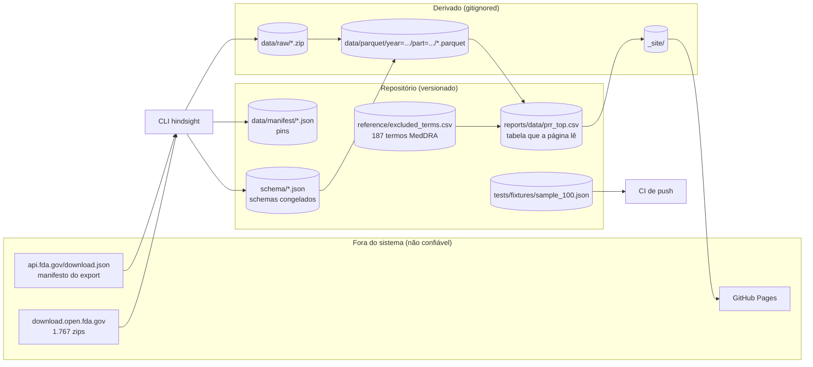
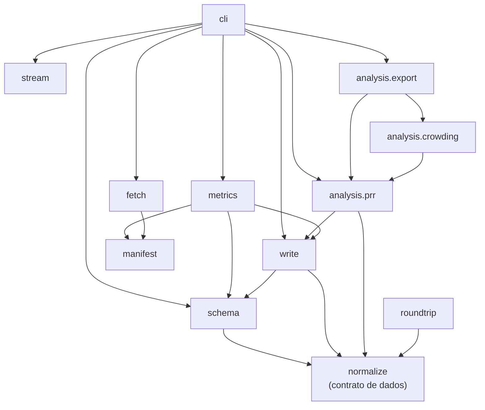

# Arquitetura do Hindsight

## Resumo executivo

O Hindsight é um pipeline em lote que lê o export público de eventos adversos do
FDA (openFDA `drug/event`), normaliza cada partição em cinco tabelas Parquet sem
perder um campo sequer, e consulta essas tabelas com DuckDB para ranquear pares
medicamento-evento por desproporcionalidade. O resultado sai como um site
estático publicado no GitHub Pages.

**A fonte da verdade é o openFDA, e nada aqui a substitui.** O repositório não
guarda os bytes originais. Ele guarda dois artefatos versionados que permitem
buscá-los de novo e verificar que são os mesmos:

- `data/manifest/<partição>.json`, o *pin*: id, URL, data do export, SHA-256 e
  tamanho em bytes.
- `schema/<partição>.json`, o schema congelado: o tipo de cada coluna das cinco
  tabelas, mais o bloco `source` que amarra o schema à partição e à data de
  export que o produziram.

Tudo o mais em `data/` é cache derivado e está no `.gitignore`. Um clone limpo
reproduz a cadeia inteira com `make all`.

**A regra arquitetural que não pode ser quebrada: o schema nunca é inferido de
uma amostra.** A ingestão tem duas passagens sobre o mesmo zip. A passagem 1 lê
*todos* os registros e escreve o schema em `schema/`. A passagem 2 escreve o
Parquet contra aquele schema congelado, e `schema.enforce` levanta `UnknownField`
para qualquer campo que o schema não tenha, antes de qualquer byte ser escrito.
Sem essa checagem o Arrow descartaria o campo em silêncio e produziria um Parquet
válido, com a contagem de linhas certa e um campo a menos.

### Arquitetura do sistema

O sistema não tem servidor, banco de dados, conta em nuvem, credencial ou
segredo. As duas únicas dependências externas em tempo de execução são os dois
endpoints do openFDA, ambos anônimos e por HTTP. A única permissão privilegiada
do projeto está no workflow `publish.yml`: `pages: write` e `id-token: write`,
usadas só para publicar `_site/`.

### Hierarquia de dependências

**As setas apontam sempre para baixo, e `normalize` é o fundo.** `normalize`,
`manifest` e `stream` não importam nada do projeto. Todo módulo que fala sobre
tabelas, colunas ou chaves importa os nomes de `normalize`, e nenhum os redefine.

Uma consequência vale ser dita em voz alta: **`roundtrip` importa `normalize` e
mais nada do projeto.** Ele não conhece `write` nem `schema`. A reconstrução é
escrita contra o contrato, não contra o escritor, então o teste de round trip é
uma verificação independente e não um espelho do código que ele deveria checar.
Se `roundtrip` passasse a importar internals de `write`, a prova central do
projeto viraria uma tautologia.

## Modelo de armazenamento: cinco tabelas

Um relatório do FAERS chega como um documento JSON aninhado. `normalize.split`
o quebra em cinco tabelas, definidas em `normalize.TABLES`:

| Tabela | Uma linha é | Colunas que o pipeline escreve |
|---|---|---|
| `report` | um relatório | nenhuma, só campos da fonte |
| `report_drug` | um medicamento dentro de um relatório | `safetyreportid`, `seq`, `openfda_key` |
| `report_reaction` | uma reação dentro de um relatório | `safetyreportid`, `seq` |
| `report_duplicate` | uma entrada de `reportduplicate` | `safetyreportid`, `seq` |
| `dim_openfda` | um bloco de enriquecimento distinto | `openfda_key` |

Regras que essas tabelas carregam:

- **Nenhuma lista de campos a manter.** `split` itera o registro. As colunas de
  `report` são os campos de topo menos `patient` e `reportduplicate`, mais os
  campos de `patient` que não sejam `drug` nem `reaction`, esses com o prefixo
  `pt_`. Se a fonte ganhar um campo novo, ele vira coluna sozinho, e é `enforce`
  que decide se aquilo pode ser escrito.
- **Colisão de nome é erro, não sobrescrita.** `normalize._row` levanta
  `UnexpectedReportShape` se um campo da fonte tiver o mesmo nome de uma coluna
  que o pipeline escreve. Sem isso um dos dois valores sumiria.
- **`dim_openfda` é chaveada por conteúdo, e escrita por partição.** A chave são
  os 16 primeiros dígitos do SHA-1 do bloco serializado em JSON canônico, então
  duas partições que contenham o mesmo bloco geram a mesma chave. Mas
  `write_partition` cria uma `OpenfdaDimension` nova a cada partição, e cada
  diretório recebe seu próprio `dim_openfda.parquet`: **a deduplicação é interna
  à partição, não de corpus.** `OpenfdaDimension.add` guarda o digest inteiro e
  levanta `KeyCollision` se dois blocos diferentes truncarem para a mesma chave,
  em vez de fundi-los.
- **`openfda` ausente e `openfda: {}` são coisas diferentes.** `add` testa
  `block is None`, nunca a veracidade do dicionário. Um bloco vazio recebe chave
  e vira linha na dimensão.
- **`seq` nulo em `report_duplicate` significa que a fonte trazia um objeto e não
  um array.** É o único marcador de forma no modelo, e `roundtrip._duplicates` o
  lê para decidir se reconstrói um objeto ou uma lista.
- **`safetyreportid` não é chave primária garantida.** `metrics` conta os ids
  repetidos por partição e grava em `repeated_report_ids`. Medido: 0 de 12.000 na
  partição de 2025, 6 de 12.000 na de 2004.

O layout em disco vem de `write.partition_dir`: buckets no formato `YYYYqN` viram
`year=<ano>/quarter=<n>/part=<parte>/`, e qualquer outro bucket (o export tem um
`all_other/`) vira `bucket=<nome>/part=<parte>/`. Cada diretório de partição
guarda os cinco `.parquet` e um `metrics.json`.

## Ciclo de vida da ingestão

`hindsight ingest <partição>` executa nesta ordem, em `cli._ingest`:

1. **Resolver** (`manifest.resolve`). Busca `api.fda.gov/download.json` com
   timeout de 30 s e monta o índice de partições do export. Toda navegação pelo
   documento passa por `_at`, que levanta `UnexpectedManifestShape` nomeando a
   chave ausente. Um id que não existe levanta `PartitionNotFound` dizendo quantas
   partições o bucket realmente tem, porque a causa comum não é erro de digitação
   e sim o openFDA ter reparticionado o trimestre entre exports.
2. **Garantir os bytes localmente** (`fetch.ensure_local`).
   - Se existem pin e arquivo, o SHA-256 do arquivo é recalculado. Bate: usa o
     cache. Não bate: **o arquivo é apagado** e `ChecksumMismatch` é levantado.
   - Senão, baixa para `<nome>.zip.part` em blocos de 1 MiB com timeout de 60 s.
     A retomada é condicionada a existir pin (`resume=pin is not None`), e o pin
     só é escrito depois de um download completo: **o primeiro download de uma
     partição nunca retoma**, ele recomeça do byte 0 e o `.part` truncado
     permanece em disco. Havendo pin, o header `Range` é enviado e a retomada só
     conta como tal se a resposta for `206`.
   - O SHA-256 é conferido contra o pin. Divergiu: o `.part` é apagado e o erro
     diz qual das duas causas se aplica (prefixo sujo ou reescrita na origem).
   - Só depois de o digest ser aceito o `.part` vira `.zip` e o pin é escrito.
     Não existe estado intermediário visível.
3. **Passagem 1, schema** (`cli._schemas`). Se `schema/<partição>.json` existe e
   `--reinfer` não foi pedido, o schema versionado é carregado e a passagem 1 é
   pulada. Senão `schema.infer` roda sobre **todos** os registros: `_observe`
   percorre cada valor em cada profundidade e levanta `SchemaConflict` se um
   caminho aparecer com dois tipos JSON, se um objeto virar array, ou se um
   escalar não for `str`, `bool`, `int` ou `float`. `_pin_pipeline_columns` fixa
   os tipos de `safetyreportid`, `seq` e `openfda_key`, e recusa se a fonte
   passar a ter um campo com esses nomes. O schema é salvo com o bloco `source`.
4. **Passagem 2, escrita** (`write.write_partition`). Segunda leitura do mesmo
   zip. Cada relatório passa por `split` e as linhas vão para cinco `ParquetSink`.
   A cada 2.000 relatórios os sinks fazem `flush`, e é no `flush` que `enforce`
   roda antes de `pa.Table.from_pylist`. Cada sink escreve em `<tabela>.parquet.part`
   e só faz `replace` no `__exit__` limpo; em exceção o `.part` é apagado. ZSTD
   nível 9.
5. **Métricas** (`metrics.snapshot`). Abre uma conexão DuckDB em memória e conta
   linhas por tabela, ids repetidos, cobertura de `companynumb`, `drugstartdate`
   e `unii`. Colunas que não existem na era daquela partição devolvem `None` em
   vez de zero, checado por `Schemas.has_column`. Grava `metrics.json` ao lado do
   Parquet.
6. **Conferência final.** `cli._ingest` compara as linhas de `report` com
   `partition.records` do manifesto e levanta `IngestError` se divergirem.

**Leitura sempre em streaming.** `stream.iter_reports` abre o membro `.json`
direto de dentro do zip e o entrega a `ijson` no prefixo `results.item`. O JSON
completo nunca é materializado, em nenhuma das duas passagens. `_sole_json_member`
exige exatamente um membro `.json` no arquivo e lista o conteúdo quando não é o
caso. Um array de resultados vazio levanta `UnexpectedArchiveShape` em vez de
produzir uma partição vazia em silêncio.

**Retomada.** O único ponto retomável hoje é o download. Ingestão interrompida
recomeça do zero, e o custo disso é a segunda leitura do zip, não um novo
download.

## O round trip, que é a prova

A afirmação de que a normalização não perde nada é a única afirmação central do
projeto, e ela tem um mecanismo próprio.

`roundtrip.Tables.load` lê os cinco Parquet e os indexa em memória.
`roundtrip.reconstruct` remonta o documento JSON aninhado a partir das tabelas.
O documento reconstruído é comparado ao original.

Três guardas fazem essa comparação significar o que diz:

- **Nulos.** O Parquet não tem coluna ausente: um relatório sem `companynumb`
  volta como `{"companynumb": None}`. Os dois lados passam por `_without_nulls`
  antes de comparar. Isso só é o inverso da escrita **se a fonte nunca carregar
  um null explícito**, então o teste mede essa precondição por relatório antes de
  comparar, em `test_the_source_carries_no_explicit_nulls`. Se a precondição
  falhar, o teste falha; ele não passa por baixo dela.
- **Ordem.** `_ordered` exige que os `seq` de um relatório sejam exatamente
  `0..n-1` e levanta `BrokenTables` caso contrário. Linha faltando ou repetida
  não é reordenada em silêncio.
- **Id ambíguo.** `_by_id` detecta `safetyreportid` repetido, remove o id do
  índice e o registra em `Tables.ambiguous`. `reconstruct` recusa **aquele
  relatório pelo nome** e levanta `BrokenTables`. Os demais da partição seguem
  reconstruíveis. A recusa é deliberada: com dois documentos sob o mesmo id não
  há informação sobre qual array pertence a qual, e adivinhar passaria no teste
  sem ser o inverso da escrita.

Duas cadências:

- **Em todo push**, contra `tests/fixtures/sample_100.json`, um fixture de 100
  relatórios versionado no repositório. Sem rede, sem partição em disco.
- **Localmente e no `make all`**, contra a partição inteira, no teste marcado
  `@pytest.mark.slow`, que o `pytest` desmarca por padrão via `addopts`.

## Da consulta até a página publicada

`analysis/prr.py` monta uma tabela de contingência 2×2 por par medicamento-evento
em uma única consulta DuckDB sobre os Parquet.

O detalhe que define a consulta: **as células contam relatórios distintos, não
linhas juntadas.** As CTEs `exposure` e `occurrence` fazem `SELECT DISTINCT` por
`safetyreportid` antes de qualquer join. Um relatório que lista o mesmo produto
862 vezes contribui com 1. Contar linhas juntadas ranquearia por quanto o
notificador repetiu o nome do produto dentro de um relatório.

Ainda na mesma consulta: os termos de `reference/excluded_terms.csv` são
removidos das ocorrências, o χ² sai com correção de continuidade de Yates, e a
CTE `breadth` calcula a *lotação* de cada par, a mediana de quantos medicamentos
distintos os relatórios por trás daquele `a` nomeiam.

`excluded_terms` recusa uma leitura vazia. O cabeçalho do CSV é prosa atrás de
`#`, e uma leitura sem `comment='#'` devolve zero linhas, o que desligaria todas
as exclusões sem nenhum sinal.

`_directory` resolve qual partição consultar. **Com mais de uma partição ingerida
e nenhuma escolhida, ele recusa**, porque o PRR é reportado por partição e não
somado entre eras. Hoje isso é o comportamento observável de `hindsight analyze`
sem argumento neste repositório, que tem 2004 e 2025 ingeridas.

`analysis/export.write_csv` fecha a cadeia até a página:

1. Resolve a partição e lê `metrics.json` dela para saber o id e a data de export
   reais. `PrrError` se o arquivo não existir.
2. Calcula o corte de lotação como o quantil 0,99 **daquela partição**, nunca uma
   constante escrita no código.
3. Escreve `reports/data/prr_top.csv` com um cabeçalho de procedência
   (`partition`, `export_date`, `min_count`, corte de lotação).
4. Relê o arquivo com o `csv` da biblioteca padrão e confere cabeçalho, número de
   linhas e largura (`_verify`), depois reparsa a procedência (`provenance`).
   Falha em qualquer uma e o CSV não é dado como escrito.

**A página lê o CSV versionado, nunca `data/parquet/`**, porque o Parquet está no
gitignore e baixar 155 MB por push foi recusado. O preço disso é que a página
pode discordar do pipeline sem nada quebrar, e a mitigação é `tests/test_provenance.py`,
que roda no CI de push e confere que a partição citada no cabeçalho tem pin
versionado, que a data de export bate com a do pin, e que existe um
`schema/<partição>.json` cujo bloco `source` concorda com os dois. **É uma checagem
de procedência, não de valor:** ela pega uma partição sem pin ou uma data que não
bate, e não pega um CSV gerado com uma lista de exclusão antiga sobre a partição
certa.

`make site` regenera o CSV antes de renderizar. O workflow `publish.yml` só roda
`quarto render`.

## Componentes

**`manifest`** possui a tradução do manifesto do openFDA para `Partition` e
`Export`. Não faz rede além do `GET` do manifesto, não toca disco e não conhece
Parquet.

**`fetch`** possui os bytes locais e os pins. É o único módulo que decide se um
arquivo em disco pode ser confiado. Não interpreta o conteúdo do zip.

**`stream`** possui a iteração incremental sobre o zip. Não sabe o que é um
relatório além de ser um `dict` sob `results.item`.

**`normalize`** possui **o contrato de dados**: os nomes das cinco tabelas, as
colunas que o pipeline escreve, o prefixo `pt_`, a chave de conteúdo do
`openfda`, e a regra do `seq` nulo. Não escreve arquivo, não conhece Arrow, não
conhece DuckDB. Todo o resto do projeto importa esses nomes daqui.

**`schema`** possui a inferência em duas passagens, a serialização do schema para
JSON e `enforce`. É quem decide o que é um tipo aceitável. Não escreve Parquet.

**`write`** possui a escrita atômica em Parquet e o layout de diretórios. Chama
`enforce` a cada flush. Não decide tipos e não mede nada.

**`metrics`** possui o `metrics.json` por partição. É o único módulo do caminho de
ingestão que usa DuckDB. Não escreve Parquet.

**`roundtrip`** possui a reconstrução do JSON a partir das tabelas. Depende só de
`normalize`. Não lê a fonte, não escreve nada, e não sabe como o Parquet foi
produzido.

**`analysis.prr`** possui a tabela de contingência, o PRR, o χ² e o critério de
Evans, mais a leitura da lista de exclusão. Não escreve arquivo.

**`analysis.crowding`** possui a métrica de lotação e o corte por quantil. Não
decide o que fazer com pares lotados: remover pares lotados exigiria resolução de
entidades, que este código não tem.

**`analysis.export`** possui o CSV publicado e sua procedência. É o único que
sabe onde a página vai buscar dados.

**`cli`** possui a ordem das etapas, o formato da saída no terminal e o mapeamento
de exceções para código de saída 1. Não contém regra de negócio.

## Limites rígidos e comportamento em falha

| Limite | Valor | Onde |
|---|---|---|
| Teto de memória que o projeto se impõe | 500 MB por partição | orçamento do projeto; ingestão medida em 219 MB, `make all` em 486,8 MB |
| Relatórios por row group | 2.000 | `write.REPORTS_PER_ROW_GROUP` |
| Compressão | ZSTD nível 9 | `write.COMPRESSION_LEVEL` |
| Bloco de download e de hash | 1 MiB | `fetch.CHUNK_BYTES` |
| Timeout do manifesto | 30 s | `manifest.REQUEST_TIMEOUT_SECONDS` |
| Timeout do download | 60 s | `fetch.DOWNLOAD_TIMEOUT_SECONDS` |
| Comprimento da chave de conteúdo | 16 dígitos hex do SHA-1 | `normalize.KEY_LENGTH` |
| Co-relatos mínimos por par | 3 | `analysis.prr.DEFAULT_MIN_COUNT` |
| Critério de Evans | PRR ≥ 2, χ² ≥ 4, a ≥ 3 | `analysis.prr.SIGNAL_*` |
| Quantil do corte de lotação | 0,99 | `analysis.crowding.DEFAULT_QUANTILE` |

Comportamento em falha:

- **Escrita sempre passa por `.part`.** Download e Parquet escrevem num arquivo
  temporário e só fazem `replace` depois da checagem. Em exceção o `.part` é
  removido. Um zip em cache cujo digest não bate com o pin é apagado, para que a
  execução seguinte comece limpa.
- **A atomicidade é por arquivo, não por partição.** Os cinco sinks vivem num
  `ExitStack` e cada um renomeia o seu independentemente. O comportamento
  tudo-ou-nada que se observa hoje vem de `write_partition` fazer o `flush` dos
  cinco *dentro* do bloco: uma recusa do `enforce` sai do `with` com exceção e os
  cinco `.part` são apagados. Não é garantia do desenho do sink, e uma falha
  durante o próprio desempilhamento deixaria um subconjunto das cinco tabelas
  commitado.
- **Erro de rede não é embrulhado.** `manifest._fetch_manifest` e
  `fetch._download` chamam o `httpx` sem `try`, e `cli.main` só captura as
  exceções do projeto. Um timeout ou um `503` do openFDA sobe como traceback, não
  como mensagem, e não há retry nem backoff.
- **Não existe quarentena.** Uma partição com campo desconhecido, tipo
  inconsistente ou contagem divergente interrompe a execução com exceção nomeada
  e código de saída 1.
- **Não existe registro de progresso.** "Partição ingerida" é inferido por
  `analysis.prr.partitions()`, que faz um glob atrás de `report.parquet`. Um
  diretório meio escrito e um nunca iniciado são indistinguíveis.

`make clean` remove `data/raw`, `data/parquet`, `_site`, `.quarto` e
`.pytest_cache`, e **preserva os pins**.

## Fronteiras de confiança

Tudo que vem do openFDA é entrada não confiável, e cada camada tem sua recusa:

| Ameaça | Guarda |
|---|---|
| Manifesto muda de layout | `manifest._at`, `_parse_partition` → `UnexpectedManifestShape` |
| Partição some por reparticionamento | `Export.partition` → `PartitionNotFound` que lista o bucket real |
| Bytes reescritos na origem | SHA-256 contra o pin → `ChecksumMismatch` |
| Zip com forma inesperada | `stream._sole_json_member` → `UnexpectedArchiveShape` |
| Campo com tipo inconsistente | `schema._observe` → `SchemaConflict` |
| Campo novo que o schema não tem | `schema.enforce` → `UnknownField` |
| Campo da fonte colidindo com coluna do pipeline | `normalize._row` → `UnexpectedReportShape` |
| Dois blocos `openfda` com a mesma chave truncada | `OpenfdaDimension.add` → `KeyCollision` |
| Relatórios sumindo entre o zip e o Parquet | `cli._ingest` contra `partition.records` → `IngestError` |
| Lista de exclusão lida como zero linhas | `analysis.prr.excluded_terms` → `PrrError` |
| Página publicada divergindo do pipeline | `tests/test_provenance.py`, no CI de push |
| openFDA fora do ar, lento ou devolvendo `5xx` | **sem guarda.** A exceção do `httpx` sobe sem tratamento |

Não há autenticação, autorização, credencial ou dado pessoal identificável
gerenciado por este código. O FAERS é um corpus público e já desidentificado na
origem. A única escrita fora do repositório é a publicação de `_site/` no GitHub
Pages, feita pelo workflow `publish.yml` com um token de identidade do próprio
Actions.

## Mapa de fontes

| Conceito | Arquivo |
|---|---|
| Contrato de dados, as cinco tabelas | `src/hindsight/normalize.py` |
| Manifesto e resolução de partição | `src/hindsight/manifest.py` |
| Download, pin e verificação de digest | `src/hindsight/fetch.py` |
| Leitura incremental do zip | `src/hindsight/stream.py` |
| Inferência, serialização e imposição de schema | `src/hindsight/schema.py` |
| Escrita atômica em Parquet e layout | `src/hindsight/write.py` |
| Métricas por partição | `src/hindsight/metrics.py` |
| Reconstrução e prova de round trip | `src/hindsight/roundtrip.py` |
| PRR, χ², Evans, lista de exclusão | `src/hindsight/analysis/prr.py` |
| Lotação e corte por quantil | `src/hindsight/analysis/crowding.py` |
| CSV publicado e procedência | `src/hindsight/analysis/export.py` |
| Ordem das etapas e CLI | `src/hindsight/cli.py` |
| Alvos reproduzíveis | `Makefile` |
| Fronteira de dependências e grupo `viz` | `pyproject.toml` |
| CI de push | `.github/workflows/ci.yml` |
| Publicação do site | `.github/workflows/publish.yml` |
| Site e navegação | `_quarto.yml`, `index.qmd`, `reports/m0.qmd` |
| Decisões, bloqueadores e lições | `.specs/project/STATE.md` |

## Verificação

Rodado neste repositório, no estado atual da árvore de trabalho:

- `uv run pytest -q`: **208 passaram, 1 desmarcado, 3,02 s.** O desmarcado é o
  round trip da partição inteira, que exige o Parquet ingerido em disco.
- `uv run hindsight analyze` sem argumento: recusa com as duas partições
  ingeridas listadas, confirmando que `analysis.prr._directory` não soma entre
  partições.
- Grafo de importações conferido arquivo por arquivo: `normalize`, `manifest` e
  `stream` não importam nada de `hindsight`; `roundtrip` importa só `normalize`.
- `schema/*.json` e `data/parquet/**/metrics.json` conferidos: as duas partições
  ingeridas têm formas de tabela diferentes (`report` com 24 colunas em 2004
  contra 31 em 2025; `report_drug` com 16 contra 29), o que confirma que a forma
  do dado depende da era e que `Schemas.has_column` é necessário e não defensivo.

Invariantes com teste que os defende:

| Invariante | Teste |
|---|---|
| A fonte não carrega null explícito, então a comparação do round trip é unilateral | `test_the_source_carries_no_explicit_nulls` |
| Todo relatório do fixture reconstrói idêntico | `test_every_fixture_report_rebuilds_identically` |
| `openfda: {}` volta como objeto vazio, não como ausente | `test_an_empty_openfda_comes_back_as_an_empty_object` |
| As duas formas de `reportduplicate` voltam como chegaram | `test_the_two_duplicate_shapes_come_back_as_they_arrived` |
| Id repetido é recusado por nome, sem derrubar a partição | `test_a_repeated_report_id_is_refused_by_name`, `test_refusing_one_report_does_not_refuse_the_partition` |
| Buraco em `seq` não é encurtado em silêncio | `test_a_gap_in_seq_is_not_quietly_shortened` |
| A partição inteira reconstrói byte a byte | `test_the_whole_partition_rebuilds_from_parquet` (marcado `slow`) |
| A página publicada aponta para uma partição com pin e schema versionados | `tests/test_provenance.py` |
| A stack de gráficos não está no ambiente padrão | passo dedicado em `.github/workflows/ci.yml` |

Lacunas de evidência, com o que resolveria cada uma:

- **O round trip da partição inteira não roda no CI de push.** Ele depende de
  `data/parquet/` local, que está no gitignore, e o download de 155 MB por push
  foi recusado. A cobertura em CI é o fixture de 100 relatórios. Resolveria: um
  job agendado que baixe uma partição e rode o teste marcado `slow`.
- **A prova de round trip cobre a partição de 2025 e não a de 2004.** Em
  `2004q1/0001-of-0005` a precondição de nulos falha, os 12.000 relatórios
  carregam pelo menos um null explícito, e o teste recusa em vez de comparar.
  Isso é o desenho funcionando, e o efeito prático é que **"byte-identical" é
  hoje propriedade das eras medidas e não do corpus.** Resolveria: distinguir
  campo ausente de campo explicitamente nulo no modelo, ou declarar e publicar o
  alcance da prova.
- **A checagem de procedência da página não checa valor.** Um CSV gerado com uma
  lista de exclusão antiga sobre a partição correta passa em
  `tests/test_provenance.py`. Resolveria: regenerar o CSV em um job que tenha o
  Parquet e comparar.
- **A folga de memória é de 13 MB.** `make all` chega a 486,8 MB contra o teto de
  500 MB, e o pico é do round trip, não da ingestão: `Tables.load` mantém uma
  partição inteira em dicionários Python (266 MB para 4,62 MB de Parquet).
  Resolveria: uma medição em partições mais densas, ou uma reconstrução que não
  segure a partição toda em memória.
- **Não existe armazenamento remoto.** `data/parquet/` é local e nada o
  sincroniza. Todos os números de projeção de corpus vêm de duas partições
  medidas de 1.767.
